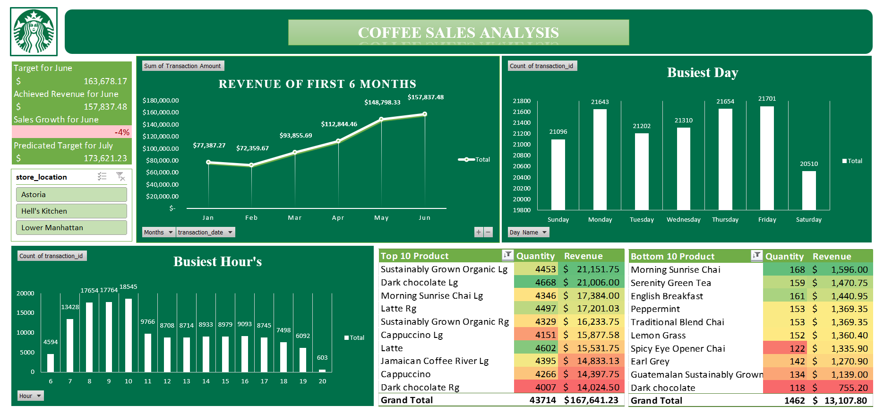

# Excel Project by Yash Yennewar

# Coffee Sales Project Dashboard

## Overview

This dashboard provides a comprehensive analysis of the performance of three coffee shop locations within a regional chain. The primary objective of this dashboard is to present actionable insights to the regional manager, focusing on optimizing store operations, improving sales, and enhancing customer satisfaction.

<a href ="Coffee Shop Sales Analysis(Project).xlsx">Coffee Shop Sales Analysis(Project)</a>

## Tool Used

&nbsp;

## Key Insights

* **Consistent Revenue Growth:** Revenue has been continuously growing, indicating steady customer interest and successful business operations.
* **Peak Days Identified:** Mondays, Thursdays, and Fridays are the busiest days across all locations, aligning with typical work schedules.
* **Peak Hours Analysis:** Morning hours see the highest customer traffic, particularly as people head to work.
* **Top-Selling Product:** Coffee is the leading category, with Barista Espresso being the best-selling product across all stores.

## Additional Insights

* **Significant Revenue Spike in May:** A notable increase in revenue was observed in May, likely due to the holiday season. This trend suggests the need for better resource management during peak months.
* **Underperforming Products:** Specific flavors, coffee beans, and merchandise (particularly clothing in Hell’s Kitchen) are among the lowest-selling items.
* **Strategic Adjustments for Hell’s Kitchen:** Merchandise clothing at this location is significantly underperforming. We should consider introducing discounts or limiting availability to online orders only to reduce operational costs.

## Recommendations

* Enhance staffing and stock management during peak days and hours to improve service quality.
* Plan targeted promotions for May, leveraging the holiday season’s revenue potential.
* Re-evaluate low-performing products and consider discounts or alternative sales strategies.
* Regularly monitor product performance at each store to quickly adapt to changing customer preferences.

## Dashboard Visualization

&nbsp;
